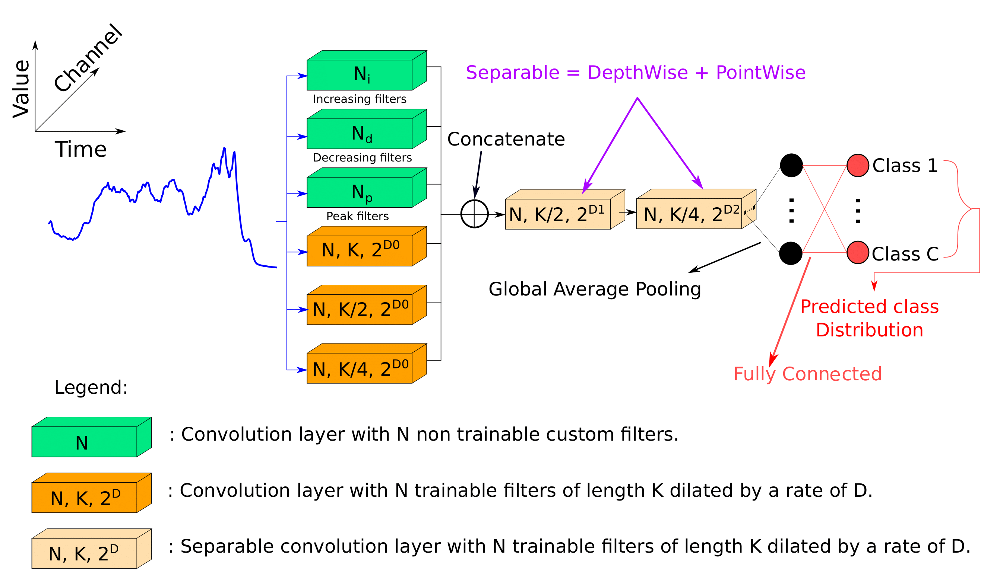
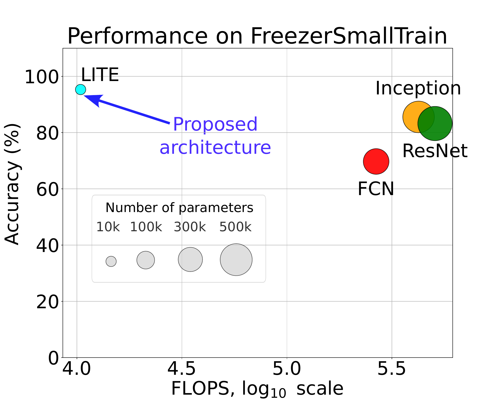
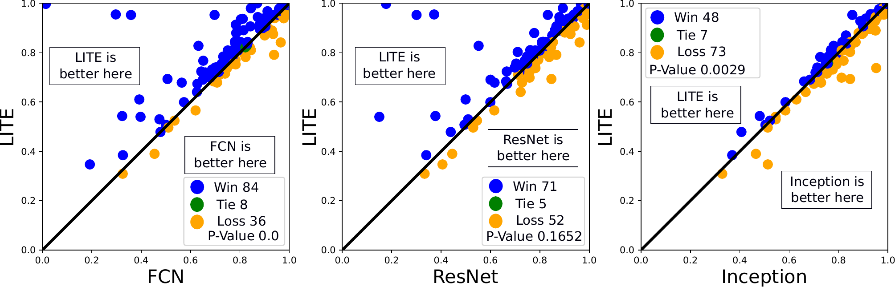
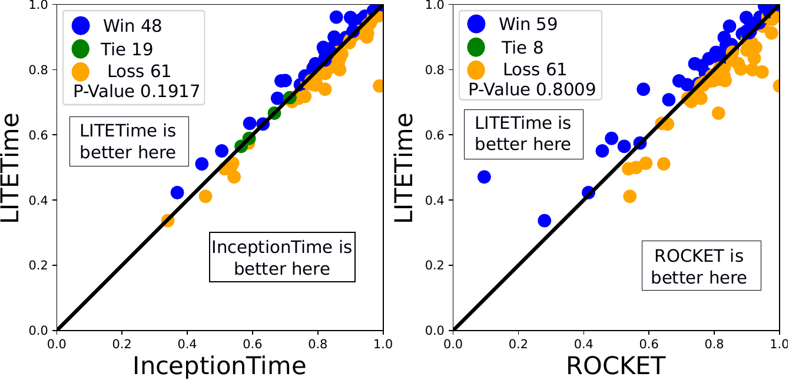
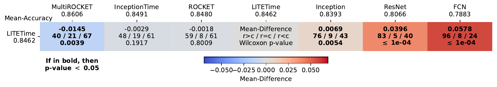
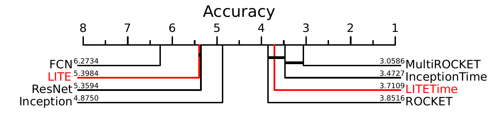

# LITE: Light Inception with boosTing tEchniques for Time Series Classification

This is the source code of our paper "[LITE: Light Inception with boosTing tEchniques for Time Series Classification](https://germain-forestier.info/publis/dsaa2023.pdf)" accepted at the 10th IEEE International Conference on Data Science and Advanced Analytics ([DSAA 2023](https://conferences.sigappfr.org/dsaa2023/)) in the  Learning from Temporal Data ([LearnTeD](https://dsaa2023.inesctec.pt/)) special session track. <br>
This work was done by [Ali Ismail-Fawaz](https://hadifawaz1999.github.io/), [Maxime Devanne](https://maxime-devanne.com/), [Stefano Berretti](www.micc.unifi.it/berretti/), [Jonathan Weber](https://www.jonathan-weber.eu/) and [Germain Forestier](https://germain-forestier.info/).

## The LITE architecture

The same LITE architecture is then used to form an ensemble of five LITE models, names LITETime.
<p align="center" width="50%">

</p>

## Usage of the code

To use this code, running the ```main.py``` file with the following options in the parsed as arguments:

```
--dataset : to choose the dataset from the UCR Archive (default=Coffee)
--classifier : to choose the classifier, in this case only LITE can be chosen (default=LITE)
--runs : to choose the number of runs (default=5)
--output-directory : to choose the output directory name (default=results/)
--track-emissions : to choose wether or not to track the training/testing time and CO2/power consumotion.
```

### Adaptation of code

The only change to be done in the code is the ```folder_path``` in the `utils/utils.py` file, this line. This directory should point to the parent directory of the UCR Archive datasets.

### Using [aeon-toolkit](https://github.com/aeon-toolkit/aeon) to Train a LITETimeClassifier on your DATA

When using aeon, simply load your data and create an instance of a LITETime classifier and train it <br>

```
from aeon.datasets import load_classification
from aeon.classification.deep_learning import LITETimeClassifier

xtrain, ytrain, _ = load_classification(name="Coffee", split="train")
xtest, ytest, _ = load_classification(name="Coffee", split="test")

clf = LITETimeClassifier(n_classifiers=5)
clf.fit(xtrain, ytrain)
print(clf.score(xtest, ytest)
```

## Results

Results can be found in the [results.csv](https://github.com/MSD-IRIMAS/LITE/blob/main/results.csv) file for [FCN](https://github.com/hfawaz/dl-4-tsc/blob/master/classifiers/fcn.py), [ResNet](https://github.com/hfawaz/dl-4-tsc/blob/master/classifiers/resnet.py), [Inception](https://github.com/hfawaz/InceptionTime), [InceptionTime](https://github.com/hfawaz/InceptionTime), [ROCKET](https://github.com/angus924/rocket), [MultiROCKET](https://github.com/ChangWeiTan/MultiRocket), LITE and LITETime. For non-ensemble methods, results are averaged over five runs, for ensemble methods, we ensemble the five runs.

### Average performance and FLOPS comparison

The following figure shows the comparison between LITE and state of the art complex deep learners. The comparison consists on the average performance and the number FLOPS.
<p align="center" width="100%">

</p>

### LITE 1v1 with FCN, ResNet and Inception

The following compares LITE with FCN, ResNet and Inception using the accuracy performance on the test set of the 128 datasts of the UCR archive.

<p align="center" width="100%">

</p>

### LITETime 1v1 with ROCKET and InceptionTime

The following compares LITE with FCN, ResNet and Inception using the accuracy performance on the test set of the 128 datasts of the UCR archive.

<p align="center" width="50%">

</p>

### LITETime MCM with SOTA

The following 1v1 and multi-comparison matrix shows the performance of LITETime with respect to the SOTA models for Time Series Classification.

The following compares LITE with FCN, ResNet and Inception using the accuracy performance on the test set of the 128 datasts of the UCR archive.

<p align="center" width="100%">

</p>

### CD Diagram

The following Critical Difference Diagram (CDD) shows the comparison following the average rank between classifiers.

<p align="center" width="100%">

</p>

## Requirements

```
numpy
pandas
sklearn
tensorflow
matplotlib
codecarbon
```

## Citation

```
@inproceedings{Ismail-Fawaz2023LITELightInception,
  author = {Ismail-Fawaz, A. and Devanne, M. and Berretti, S. and Weber, J. and Forestier, G.},
  title = {LITE: Light Inception with boosTing tEchniques for Time Series Classification},
  booktitle = {International Conference on Data Science and Advanced Analytics (DSAA)},
  year = {2023}
}
```


## Acknowledgments

This work was supported by the ANR DELEGATION project (grant ANR-21-CE23-0014) of the French Agence Nationale de la Recherche. The authors would like to acknowledge the High Performance Computing Center of the University of Strasbourg for supporting this work by providing scientific support and access to computing resources. Part of the computing resources were funded by the Equipex Equip@Meso project (Programme Investissements d’Avenir) and the CPER Alsacalcul/Big Data. The authors would also like to thank the creators and providers of the UCR Archive.


